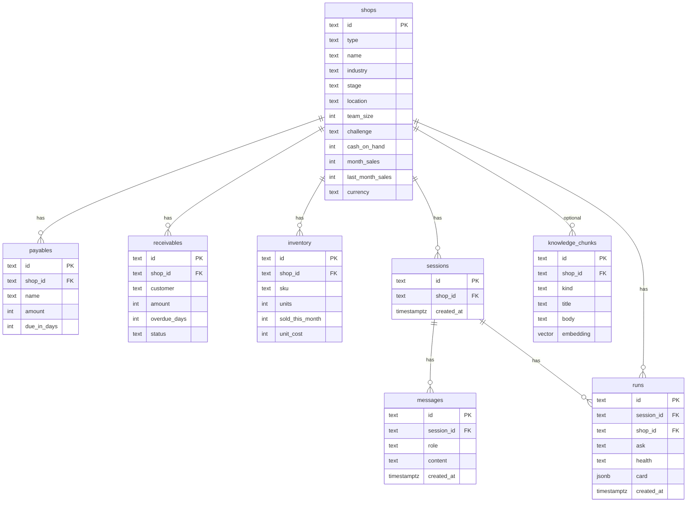

# Database design

Optional **Neon Postgres + pgvector**. One `DATABASE_URL`. Empty URL = in-memory P0 (Daw Hla still runs).

Ledger tools (`cash_pressure`, `receivable_rank`, `slow_stock`, `supplier_pressure`, `resource_load`, `business_pulse`) remain the source of truth for MMK and names. Vector rows are **practice / trust / reminder** text only — never invented balances.

Spec: FEATURES.md F-014 / F-015. Runtime: `src/lib/db/`.

The `shops` table holds **SME and founder ventures** (wholesale, retail, kitchen, studio, online, workshop) — not retail-only.

---

## Why this shape

| Need | Store |
| --- | --- |
| Shop / venture snapshot the tools read | Relational rows (not a blob of “AI memory”) |
| Who to collect / what not to restock | `receivables`, `payables`, `inventory` |
| One brief per ask | `runs.card` JSONB (F-003 contract) |
| Copy reminder / voice transcript | `sessions` + `messages` |
| “How we decide” without inventing numbers | `knowledge_chunks.embedding vector(768)` |

No POS, no bank APIs, no loan score table.

---

## ERD



---

## Table dictionary

### `shops`

One row per sample (or owner) shop. Canonical seed: `daw-hla`.

| Column | Type | Notes |
| --- | --- | --- |
| `id` | text PK | `daw-hla`, `lin-htet-mart`, … |
| `type` | text | `wholesale` \| `retail` \| `restaurant` \| `services` \| `online` \| `manufacturing` |
| `name` | text | Display name |
| `industry`, `stage`, `location` | text | Context for the crew |
| `team_size` | int | Context only |
| `challenge` | text | Owner’s this-week tightness |
| `cash_on_hand` | int | MMK integer |
| `month_sales`, `last_month_sales` | int | MMK integer |
| `currency` | text | Always `MMK` |

### `payables`

Upcoming bills. Tool: `cash_pressure` sums rows with `due_in_days <= 7`.

| Column | Notes |
| --- | --- |
| `amount` | MMK integer, never invented |
| `due_in_days` | 0 = due today |

Daw Hla seed: supplier payable **500,000** due in **5** days.

### `receivables`

Named credit. Tool: `receivable_rank` (overdue first, then amount, then days).

| Column | Notes |
| --- | --- |
| `customer` | Real name from snapshot or extracted note |
| `status` | `pending` \| `overdue` |
| `overdue_days` | 0 if pending |

Daw Hla seed: Ko Min 200,000 overdue 7d; Ma Su 150,000 pending.

### `inventory`

Stock as a **cash trap** signal, not a warehouse app. Tool: `slow_stock` (high units, low sold).

Daw Hla seed: Product A, 20 units, 2 sold, unit cost 50,000 (~1,000,000 on shelf).

### `sessions` / `messages`

Crew conversation. `role` is `user` \| `assistant`. Not a second chatbot product — audit trail for a run.

### `runs`

One analyze click → one card.

| Column | Notes |
| --- | --- |
| `ask` | Owner message |
| `health` | `OK` \| `WATCH` \| `TIGHT` only |
| `card` | JSONB matching F-003 (`priority`, `evidence`, optional `reminder`) |

### `knowledge_chunks` (vector)

Gemini `text-embedding-004` → **768** dims. Index: HNSW, cosine (`<=>`).

| `kind` | Use |
| --- | --- |
| `practice` | How to pick an action (no MMK) |
| `trust` | Ledger wins; do not invent people |
| `reminder` | Copy-only collection style |
| `bank` | “Helps organize numbers for a discussion” |

`shop_id` null = global. `shop_id = daw-hla` = wholesale pattern, still no amounts.

Query: Finance `search_knowledge` **after** cash tools. Critic drops any MMK/name not in the ledger.

---

## Data flow

```text
Owner numbers (dashboard) ──► merge into session ledger
                              │
                    optional Neon hydrate (shops + lines)
                              │
              cash_pressure / receivable_rank / slow_stock
                              │
                    search_knowledge (pgvector)  ← practice only
                              │
                    one JSON brief + critic
                              │
                    INSERT runs + messages
```

If Neon is down or `DATABASE_URL` is empty: same tools, catalog seed, no vector hits.

---

## Seed

On first successful connect (`ensureDb`), and again via `GET /api/db/seed`:

1. `CREATE EXTENSION vector`
2. Create tables
3. Upsert **all** catalog shops + payables / receivables / inventory
4. Upsert knowledge texts for every shop type (practice / trust / reminder / bank)
5. Write `embedding vector(768)` — Gemini `text-embedding-004` when the key is set, hashed fallback otherwise
6. Demo `sessions`, `messages`, and `runs` (one Analyze card per shop)

Empty inventory on services/founder rows is intentional — do not invent stock.

---

## Env

```
DATABASE_URL=postgresql://…@…/neondb?sslmode=require
GEMINI_API_KEY=          # embeddings + live brief
GEMINI_EMBED_MODEL=text-embedding-004
```

Pooled Neon URI. Do not commit `.env`.
