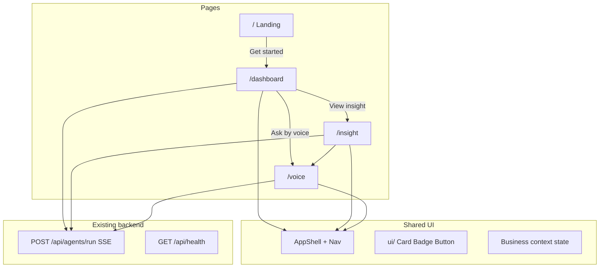

# SME Copilot — Frontend Plan

> AI decision assistant for Myanmar SMEs. Fresh UI — ignore the existing Foundry sample (`/console`, dark theme). Backend SSE crew stays; frontend is rebuilt.

**Product promise:** *"Tell me what matters, why it matters, and what I should do next."*

---

## TODO

- [x] Mobbin research — Jobber, Rox, Sprig, Xero, ElevenLabs, ChatGPT references locked
- [ ] Design system — light SaaS tokens in `globals.css` + `ui/` primitives (Badge, Button, Card, MetricTile)
- [ ] Shared layout — `AppShell`, `MarketingNav`, `BrandMark` in `src/components/layout/`
- [ ] Landing `/` — hero, feature cards, product preview, CTA → `/dashboard`
- [ ] Dashboard `/dashboard` — health badge, metrics, today's priority, insights feed, Analyze CTA
- [ ] Insight `/insight` — full analysis sections, evidence, recommended action
- [ ] Voice `/voice` — mic waveform, transcript, Talk + text fallback, browser Speech APIs
- [x] Backend wiring — handle SSE `done` event + `card`; snapshot from dashboard financials
- [ ] Polish — responsive (375px), loading/error/empty states, `npm run build`, demo rehearsed

---

## Routes

| Route | Page | Primary job |
|-------|------|-------------|
| `/` | Landing | Problem → value → **Get started** |
| `/dashboard` | Dashboard | Business health + today's priority at a glance |
| `/insight` | Insight | Full AI analysis, risks, evidence, recommended action |
| `/voice` | Voice chat | Speak to the copilot; see transcript + AI reply |

---

## Mobbin references (adapt, do not clone)

### Landing `/`

| Reference | Pattern | Link |
|-----------|---------|------|
| Jobber | Light hero, product screenshot, dual CTA, trust logos | [Mobbin](https://mobbin.com/screens/d945702b-2623-48d8-bb2e-f3834eee1388) |
| Retool | Bold headline + pill CTAs + product preview | [Mobbin](https://mobbin.com/sites/sections/0b2f4666-1ef9-4436-b9ae-dd084b4967f8) |
| Intercom | Feature cards + dark CTA banner | [Mobbin](https://mobbin.com/sites/sections/a27d1861-ec2f-4b71-9aa8-041294e6e908) |

**Layout:**

```
Nav (logo + Dashboard link + Get started)
↓
Hero: headline + sub + [Open dashboard] [Try voice]
↓
3 feature cards (Analyze / Prioritize / Act)
↓
Product preview mock (dashboard screenshot frame)
↓
Footer
```

### Dashboard `/dashboard`

| Reference | Pattern | Link |
|-----------|---------|------|
| Rox | Sidebar + "focus for today" + action cards | [Mobbin](https://mobbin.com/screens/3f692f59-31ca-4254-8d47-1112661613a1) |
| Xero | Metric tiles + cashflow area + sidebar | [Mobbin](https://mobbin.com/screens/dd15bfb2-c72b-4380-9ab7-fb16b3f7e9de) |
| Sprig | Ask AI bar + insights card + metric chips | [Mobbin](https://mobbin.com/screens/9959c94b-fcd0-484b-9547-070c13133d31) |

**Layout:**

```
AppShell sidebar: Dashboard | Insight | Voice
↓
Header: "Good morning, {business}" + [Analyze now]
↓
Row 1: Business Health badge (OK / WATCH / RISK) + 3–4 metric tiles
↓
Row 2: TODAY'S PRIORITY card (dominant) + Risk alert card
↓
Row 3: AI Insights list (click → /insight?id=...)
↓
Optional: collapsible business context form
```

### Insight `/insight`

| Reference | Pattern | Link |
|-----------|---------|------|
| Rox insight modal | Summary + recommended action + evidence + CTA | [Mobbin](https://mobbin.com/screens/3f692f59-31ca-4254-8d47-1112661613a1) |
| Sprig AI Insights | Summary chip + paragraph + timestamp | [Mobbin](https://mobbin.com/screens/9959c94b-fcd0-484b-9547-070c13133d31) |
| Peec AI | Priority action cards (Done / Todo) | [Mobbin](https://mobbin.com/screens/bf1f0dfc-94de-4d62-af35-653fbcd49dc3) |

**Layout:**

```
Breadcrumb: Dashboard → Insight
↓
Header: issue title + health badge + generated date
↓
What's happening → What is wrong → Why it matters
↓
Today's priority (recommended action + CTA)
↓
Supporting evidence (bullets from specialist memos)
↓
[Ask in voice] [Back to dashboard]
```

### Voice `/voice`

| Reference | Pattern | Link |
|-----------|---------|------|
| ElevenLabs | Center orb/waveform + live badge + transcript sidebar | [Mobbin](https://mobbin.com/screens/cf492872-e47b-453b-b476-0b5495411a83) |
| ChatGPT voice | Center waveform + cancel/confirm | [Mobbin](https://mobbin.com/screens/874aee2b-7f1c-4a52-9751-c36de1f13b01) |
| Grok Voice Agent | Talk / Call + mic picker + chat history | [Mobbin](https://mobbin.com/screens/6934e20d-16fa-4bd9-8baf-35952ca6e605) |

**Layout:**

```
AppShell (same sidebar)
↓
Center: mic button + waveform + status (Listening / Processing / Speaking)
↓
Transcript thread (user + copilot bubbles)
↓
Bottom: [Talk] [Type message…] [Send]
```

**MVP scope:** Browser `SpeechRecognition` + `speechSynthesis` — no paid voice API. Text fallback if mic denied.

---

## Design system (new — not Foundry sample)

Light SaaS theme (Jobber/Rox inspired).

| Token | Value |
|-------|-------|
| Background | `#f8f9fb` |
| Surface / cards | `#ffffff` |
| Text primary | `#111827` |
| Text muted | `#6b7280` |
| Primary accent | `#2563eb` |
| OK | `#059669` |
| Watch | `#d97706` |
| Risk | `#dc2626` |
| Border | `#e5e7eb` |
| Radius | `12px` cards, `9999px` pills |
| Font | System sans (Segoe UI / Inter) |

- **App pages** (`/dashboard`, `/insight`, `/voice`): `AppShell` with sidebar nav
- **Landing** (`/`): standalone `MarketingNav`

---

## Architecture



---

## File structure

```
src/app/
├── page.tsx                 # Landing (rewrite)
├── dashboard/page.tsx       # NEW
├── insight/page.tsx         # NEW (?id= query)
├── voice/page.tsx           # NEW
├── layout.tsx               # metadata → SME Copilot
└── globals.css              # light theme tokens

src/components/
├── layout/
│   ├── app-shell.tsx
│   ├── marketing-nav.tsx
│   └── brand-mark.tsx
├── ui/
│   ├── badge.tsx
│   ├── button.tsx
│   ├── card.tsx
│   └── metric-tile.tsx
├── landing/
│   ├── hero.tsx
│   ├── feature-cards.tsx
│   └── product-preview.tsx
├── dashboard/
│   ├── health-banner.tsx
│   ├── priority-card.tsx
│   ├── metrics-row.tsx
│   └── insights-feed.tsx
├── insight/
│   ├── insight-header.tsx
│   ├── analysis-sections.tsx
│   └── evidence-list.tsx
└── voice/
    ├── voice-visualizer.tsx
    ├── transcript-panel.tsx
    └── voice-controls.tsx

src/lib/brief/
├── types.ts                 # BriefInsight, BusinessSnapshot
├── build-from-memos.ts      # SSE memos → structured UI
└── demo-data.ts             # fallback before first run
```

**Ignore for new UI (leave in repo, don't link):** `src/app/console/`, `src/components/console/`, `src/components/SiteChrome.tsx`

---

## Page specs

### Landing `/`

- **Primary CTA:** Open dashboard → `/dashboard`
- Hero + Myanmar SME decision-gap copy (see `PROBLEMS.md`)
- Secondary CTA: Try voice → `/voice`
- 3 features: Analyze · Detect risk · Get today's priority
- Static dashboard preview frame
- Server component where possible

### Dashboard `/dashboard`

- **Primary CTA:** Analyze my business → SSE run
- Business Health badge + summary
- Metric tiles: Cash, Receivables, Upcoming expenses, Inventory flag
- Today's Priority card (dominant)
- AI Insights feed → `/insight?id=...`
- Collapsible business context (name, industry, location, challenge + optional financial fields)
- Initial data from `demo-data.ts`; update from SSE on analyze

### Insight `/insight`

- Entry: `/insight?id=cashflow` from dashboard or direct
- Sections: happening → wrong → matters → do → why → evidence
- **Primary CTA:** Do this today (clipboard or open `/voice` with prompt)
- Same `BriefInsight` object as dashboard

### Voice `/voice`

1. Talk → `SpeechRecognition` + waveform
2. Stop → user bubble in transcript
3. POST `/api/agents/run` with transcript
4. Stream reply → copilot bubble; optional `speechSynthesis`
5. Text input always available

States: idle · listening · processing · speaking · error

---

## Backend integration

Reuse `POST /api/agents/run` — no new endpoints for MVP.

Handle full SSE contract including **`done`**:

```typescript
if (event.type === "done") {
  setMemos(event.memos);
  setReply(event.reply);
  setBrief(buildBriefFromMemos(event.memos, event.reply, context));
}
```

Optional later: structured `brief` event per `FEATURES.md` JSON schema.

---

## Build order (~3.5 h)

| Step | Time | Output |
|------|------|--------|
| 1. Design system + AppShell + ui/ | 40 min | Shared layout, tokens |
| 2. Landing `/` | 35 min | Marketing page |
| 3. Dashboard `/dashboard` | 60 min | Core demo + SSE |
| 4. Insight `/insight` | 35 min | Detail view |
| 5. Voice `/voice` | 45 min | Mic UI + transcript |
| 6. States + mobile + build | 35 min | Demo-ready |

---

## Out of scope

- Foundry dark theme or `/console` in nav
- Full shadcn scaffold
- Real DB, auth, live charts
- Burmese i18n (P1)
- ElevenLabs / paid voice API
- More than 4 main routes

---

## Demo script (60 s)

1. `/` — problem + value prop
2. `/dashboard` — WATCH status, cash pressure, today's priority
3. `/insight` — full why + evidence + action
4. `/voice` — "Who should I follow up for payment?"
5. Re-run analyze on dashboard

---

## Verification

- [ ] Brand is **SME Copilot** everywhere
- [ ] All 4 routes work and link correctly
- [ ] Dashboard analyze works in demo mode (no API key)
- [ ] Insight shows structured sections
- [ ] Voice: mic or text fallback works
- [ ] Mobile at 375px (sidebar → hamburger)
- [ ] `npm run build` passes
- [ ] `/console` not in primary nav
